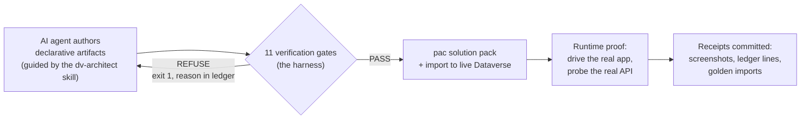
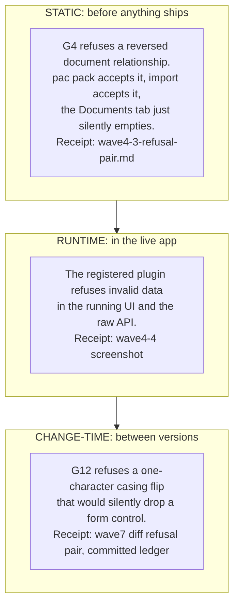
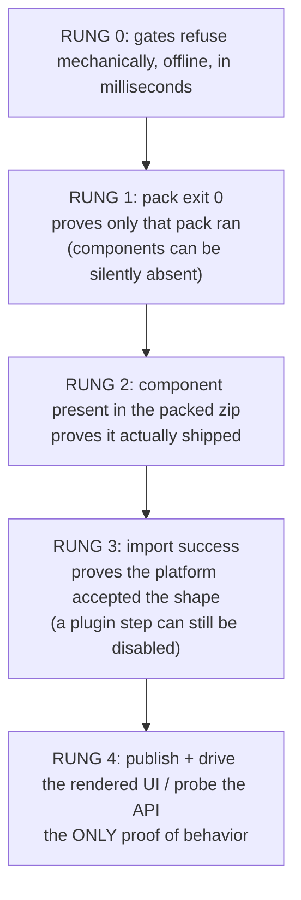
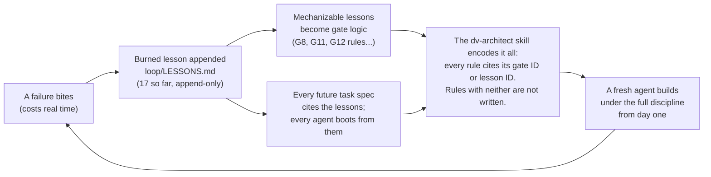

# DVerse

**Governed, pro-code agentic development for Microsoft Dataverse.**

AI agents build Power Platform solutions here, and a verification harness mechanically **refuses** anything that breaks the rules, including the failures the platform itself accepts silently. Every claim in this README has a receipt in this repository.

Second generation of the DVerse series: successor to the archived [DVerseClaudeSkills](https://github.com/tbalt88/DVerseClaudeSkills) seed (d365-architect-v3), rebuilt from the ground up as a governed system.

[](https://github.com/tbalt88/DVerse/actions/workflows/gates-offline.yml)
[](https://github.com/tbalt88/DVerse/actions/workflows/gates-online.yml)

> **Status: waves 0 to 8 complete.** Eleven gates run offline and online over a real, imported Dataverse solution, with 253 tests, six golden imports, a running model-driven app with an active plugin, live SharePoint document management, a solution-aware two-screen canvas app in gated source, and a semantic diff engine that refuses silent changes between any two versions of the tree. Externally audited before publication ([`docs/assurance/l3-round-1.md`](docs/assurance/l3-round-1.md)).

## The idea in 60 seconds

The Power Platform describes everything it builds as **declarative artifacts**: Dataverse solution XML, FormXML, sitemaps, canvas app sources unpacked to `.pa.yaml`. Declarative means diffable. **Diffable means gateable.**

DVerse tests whether that property can carry real governance: instead of a human reviewing what an AI agent built, code-enforced gates run natively against the artifacts and **mechanically refuse** ungated output, with an auditable ledger of every verdict. Everything here is built by Claude models; no other vendor's models are used.



The core insight the whole project turns on: **the platform accepts broken things silently.** A form control with wrong casing renders as if it never existed. A reversed relationship empties a Documents tab with no error. A "successfully imported" plugin can be sitting disabled. The gates exist to refuse exactly this class of failure, before it costs anyone a debugging session.

## What it can do

- **Refuse defects the platform accepts.** Eleven gates over solution manifests, tables, forms, relationships, plugins, and canvas apps, each with a red fixture proving it actually refuses (see [the gate catalogue](#the-gate-catalogue)).
- **Refuse silent *changes*, not just silent states.** A structural diff engine (G12) compares any two versions of the tree using a platform-verified element identity model, and refuses the change classes this project got burned by ([`docs/receipts/wave7-diff-refusal-pair.md`](docs/receipts/wave7-diff-refusal-pair.md)).
- **Ship real software under those gates.** The demo solution was built by agents under the harness and imported six times into a live environment: a table, a form, a registered and active plugin, a document-management relationship, an app module, and a solution-aware canvas app.
- **Prove behavior at runtime, not just at build time.** The plugin blocks bad input in the running app; documents upload to real SharePoint; the canvas app does full CRUD against live data, all receipted with screenshots and API probes.
- **Teach what it learned.** The `dv-architect` skill encodes every burned lesson and gate rule so a fresh agent can build under the same discipline (see [How it learns and grows](#how-it-learns-and-grows)).

## Refusal, proven at three altitudes

The refusal thesis is not one demo; it holds at every level where a defect can hide:



**The flagship receipt** (wave 4.3): two runs of the same offline CLI over the same relationship, one relationship direction apart, 22 seconds apart. The correct version: all gates PASS, exit 0. The inverted copy: REFUSE, exit 1, with the exact symptom named in the reason. Both versions pack clean with `pac solution pack` at exit 0, and Dataverse's own documentation confirms the inverted direction just silently stops listing documents. Full verbatim ledger lines: [`docs/receipts/wave4-3-refusal-pair.md`](docs/receipts/wave4-3-refusal-pair.md).

## The verification ladder

Hard-won doctrine, stated as a diagram because every rung was paid for: **each rung proves only itself.**



Three separate silent-failure classes were found exactly this way: shapes that pack cleanly but fail import, manifest entries whose absence drops whole folders from the zip at exit 0, and a "successful" import that shipped an inert plugin. The golden imports and runtime receipts below exist because nothing below rung 4 can substitute for them.

## How it learns and grows

DVerse is built to get better every time something bites. The mechanism is a flywheel, and it ran seventeen times in this engagement:



**Upskilling is efficient by construction.** A new agent (or human) does not re-learn from failures; it boots from [`plugins/dv-architect/`](plugins/dv-architect/), where every rule carries its evidence: `[G4]` means a gate mechanically enforces it, `[L14]` means a burned lesson proves it. This was tested, not assumed: a blind transfer eval gave a fresh agent the skill directory as its **only** knowledge source and scored its answers to ten scenario traps against the ground truth. Result: 20/20, including every silent-failure flagship, with correct citations ([`docs/evals/wave6-skill-eval.md`](docs/evals/wave6-skill-eval.md); its blinding caveat is stated in the doc).

Growth has a defined path too: the gate catalogue is a registry, every gate follows one contract (evidence mandatory, fail closed, red fixture, discovered by the integration sweep), so adding governance for a new artifact class is a bounded, repeatable exercise. Wave 5 proved it by adding canvas gating (G11) in one slice; wave 7 proved it again at much larger scale with the diff engine (G12).

## Where this sits in the AI SDLC

DVerse is a working implementation of an AI-governed software development lifecycle for one platform. Mapping each AI SDLC stage to what runs here:

| AI SDLC stage | DVerse implementation | Enforcement |
|---|---|---|
| Plan and specify | Every work slice gets a persisted spec with frozen rulings before any agent spawns (`loop/specs/`) | process, on the record |
| Generate | Agents author declarative artifacts guided by the `dv-architect` skill's cited rules | skill, evidence-linked |
| **Gate (the differentiator)** | Eleven gates refuse ungated output mechanically, offline, before merge; exit-code contract 0/1/2 | **code-enforced** |
| Verify | The verification ladder: pack, zip-presence, golden import, publish, runtime probe | process + receipts |
| Review changes | G12 structural diff refuses burned change classes between baseline and head | **code-enforced** |
| CI/CD | Two tiers: offline on every PR including forks (zero credentials), online post-merge via OIDC (zero secrets) | **code-enforced** |
| Audit | Append-only JSONL refusal ledger; every verdict carries evidence; independent pre-publication assurance round | code + external audit |
| Learn | Burned lessons feed specs, gates, and the skill (the flywheel above) | process, append-only |

The honest one-line summary: **generation is commoditized; refusal is not.** Plenty of tooling helps AI build on this platform. This repo is about the layer that says no.

For how this machinery composes into a full deployment pipeline (DEV to TEST to PROD, managed solutions, service principals per stage), see the ALM strategy exercise: [`docs/alm-pipeline-strategy.md`](docs/alm-pipeline-strategy.md).

## The gate catalogue

Eleven gates live. G5 (plugin registration sanity, correlating registration YAML against plugin C# source) is deferred but now UNBLOCKED: wave 4.4 produced a real, canonical, platform-mirrored registration shape, which is exactly the ground truth G5 was waiting for. It is backlog, not built.

| Gate | Rule | Failure mode it catches |
|---|---|---|
| G1 | artifacts parse and match schema | loud |
| G2 | `CustomizationPrefix: dv`, entity dirs `dv_` prefixed | loud |
| G3 | no dangling component references, `missingdependencies.yml` honest | loud at import |
| G4 | entity to `SharePointDocumentLocation` is 1:N | **silent**, flagship |
| G5 | plugin stage, mode, `FilteringAttributes` match code | deferred |
| G6 | plugins compile, xUnit suite green | loud |
| G7 | Power Apps Checker ruleset (Microsoft's, composed not authored) | loud, online only |
| G8 | `rootcomponents.yml` declarations have source on disk | silent, exit 0 |
| G9 | `solutioncomponents.yml` paths resolve | silent, exit 0 |
| G10 | manifests under `solutions/<name>/`, not root | misleading error |
| G11 | canvas `.pa.yaml` parses, controls declared, Properties are `=`-prefixed formulas | **silent**, controls drop at render |
| G12 | structural diff between a baseline and the current tree refuses burned change-classes (datafieldname casing, unsurveyed types, packaging removals with source present) | **silent**, the change-time analog of G4; baseline-activated, honest SKIP otherwise |

Running the CLI against the live demo solution, this pass, offline:

```
dverse gate run  stage=integration  gates=10

PASS   G1   well-formedness                    demo-solution
PASS   G2   publisher-prefix                   demo-solution
PASS   G3   dependency-integrity               demo-solution/solutions/DVerseCore/missingdependencies.yml
PASS   G4   document-location-cardinality      demo-solution/entityrelationships
PASS   G6   build-and-tests                    demo-solution/plugins/DVerse.Plugins.Tests/DVerse.Plugins.Tests.csproj
PASS   G6   build-and-tests                    demo-solution/plugins/DVerse.Plugins/DVerse.Plugins.csproj
PASS   G8   rootcomponent-sources              demo-solution/solutions/DVerseCore/rootcomponents.yml
PASS   G9   solution-component-paths           demo-solution/solutions/DVerseCore/solutioncomponents.yml
PASS   G10  yaml-layout                        demo-solution/solutions
PASS   G11  canvas-yaml                        demo-solution/canvasapps
SKIP   G12  structural-diff                    demo-solution
       no baseline provided; structural diff requires two trees

10 passed, 0 refused, 1 skipped.
```

With a baseline (`gate run --baseline <tree>` or the dedicated `dverse diff` verb), G12 activates; the committed ledger carries a real refusal pair produced that way. (G7 needs a tenant connection and runs only in the online CI tier.)

## Six golden imports

Reality checked against a real Dataverse environment six times, not just against the packer:

| Version | What | Receipt |
|---|---|---|
| 0.1.0.0 | Shell: publisher and container, zero components, imported to `dexevo` | [`docs/receipts/wave2-solutions-list.png`](docs/receipts/wave2-solutions-list.png), [`wave2-solution-detail.png`](docs/receipts/wave2-solution-detail.png) |
| 0.2.0.0 | `dv_matter` table, attributes, main form, imported on the fifth attempt after mirroring a platform-authored reference; live FetchXML confirmed all three custom columns | [`docs/receipts/wave4-matter-imported.png`](docs/receipts/wave4-matter-imported.png) |
| 0.3.0.0 | Document-location relationship, imported first try after the refusal pair was proven offline | [`docs/receipts/wave4-3-refusal-pair.md`](docs/receipts/wave4-3-refusal-pair.md) |
| 0.4.0.0 | App module and sitemap in source; app still renders all four form fields after the overwrite | [`docs/receipts/wave4-6-form-fixed-all-fields.png`](docs/receipts/wave4-6-form-fixed-all-fields.png) |
| 0.5.0.0 | Declarative plugin registration (canonical shapes via platform-mirror); step ACTIVE only with `--activate-plugins`, proven by a negative-input probe that caught the disabled-step escape | [`docs/receipts/wave4-4-plugin-blocks-invalid-number.png`](docs/receipts/wave4-4-plugin-blocks-invalid-number.png) |
| 0.6.0.0 | Matter Canvas made solution-aware (wave 8 addendum, post-audit): CanvasApp component in source as `canvasapps/dv_mattercanvas_791bc.meta.yml` with the msapp EXPLODED as a directory the packer re-zips (decompile-confirmed shape); G8's wave-1 directory guess for type 300 refused the platform's real file shape and was corrected, lesson 16's class again; post-import probes confirm plugin active and app registered | [`docs/wave-8-closing.md`](docs/wave-8-closing.md) addendum |

Beyond imports, runtime receipts: SharePoint document upload with the auto-created 1:N document location ([`wave5-3`](docs/receipts/wave5-3-documents-tab-live-upload.png)), and a two-screen canvas app driven through full CRUD against the same table ([`wave5-5`](docs/receipts/wave5-5-canvas-crud-created.png), [`wave5-2`](docs/receipts/wave5-2-canvas-screen2-detail.png)).

A model-driven Matter App renders `dv_matter` in the org today, and its main form renders all four authored fields; a record was created and saved through the running app as the receipt ([`docs/receipts/wave4-6-form-fixed-all-fields.png`](docs/receipts/wave4-6-form-fixed-all-fields.png)). The root cause of the earlier Owner-only rendering was `datafieldname` casing in FormXml, another member of the silently-accepted class: see `loop/LESSONS.md` entry 14.

## CI, two tiers

- **Offline** (`gates-offline.yml`): ubuntu-latest, zero credentials, runs on every push to main and every pull request including forks. Runs the full test suite and a CLI exit-code smoke test proving the 0/1/2 contract actually behaves that way in CI, not just locally.
- **Online** (`gates-online.yml`): windows-latest (net462 plugin projects need a .NET Framework runtime), path-filtered, authenticates to the tenant via OIDC federation with no stored secret, runs the full gate set including G7 against the real environment, and uploads the ledger and checker output as artifacts.

## Testing

**253 tests**, zero skips, re-run for this pass. The G6 parallel-execution flake previously reported here (lesson 13) was closed by slice O11 with per-test isolated fixture copies; five consecutive full-suite runs proved the fix and it has not recurred since.

Suite command: `dotnet test harness/DVerse.Harness.Tests/DVerse.Harness.Tests.csproj --nologo -v minimal`.

Every gate ships a fixture it refuses (`harness/fixtures/g*/refuse-*`), discovered from disk by the integration sweep rather than hand-enumerated, so a new red fixture is covered automatically and a deleted one shows up as a drop in the executed count.

## Where this sits in the Microsoft ecosystem

DVerse layers on top of Microsoft's official tooling. It does not replace or vendor it.

[`microsoft/power-platform-skills`](https://github.com/microsoft/power-platform-skills) covers the app layer: canvas apps, model-driven apps, Power Pages, Power Automate, mobile, code apps, MCP apps. That territory is theirs and they ship it daily.

Their plugins help you **build**. DVerse **gates**. That is the distinction, and it holds across the whole surface: nothing in their marketplace mechanically refuses output that violates a rule, and nothing there produces an auditable refusal ledger.

DVerse covers two things their marketplace does not: **governance gates** over Power Platform declarative artifacts, and **Dataverse backend pro-code** (plugin assemblies, custom APIs, workflow activities), which has no plugin of theirs at all.

Scope note, stated honestly: DVerse gates canvas app sources as well as Dataverse solutions. That overlaps their `canvas-apps` territory on the build side. We are not competing on generation; we are adding the layer above it.

See [`docs/upstream-map.md`](docs/upstream-map.md) for exactly what is consumed, at what pinned version, and what was deliberately declined.

## Repository map

| Path | Component | State |
|---|---|---|
| `plugins/dv-architect/` | `dv-architect` skill, evolved from the seed `d365-architect`, every rule cross-referenced to a gate ID or a burned lesson, laid out to the Microsoft marketplace convention | evolved, wave 6A |
| `harness/` | Verification gates, identity model, and semantic diff engine; refuses ungated output | eleven gates live: G1 to G4, G6 to G12 (G12 baseline-activated) |
| `demo-solution/` | Solution built BY the agent UNDER the harness, with receipts | dv_matter table, form, registered plugin, document-location relationship, app module, solution-aware canvas app; six golden imports |
| `loop/` | The learning substrate: burned lessons, slice specs, committed gate ledger | 17 lessons, append-only |
| `docs/` | Wave closing records, receipts, design docs, assurance round, ALM strategy | every claim's evidence |

## Provenance: inherited vs built

Honesty about what is ours matters more here than anywhere, because this project's claim is auditability.

**Inherited (consumed, not written by us):**
- Power Apps Checker service, via `microsoft/powerplatform-actions`. The Solution Checker gate is Microsoft's, not ours. We compose it.
- Dataverse SDK core assemblies (`Microsoft.CrmSdk.CoreAssemblies`), via NuGet, pinned.
- `Microsoft.PowerPlatform.Dataverse.Client` is DECLARED as an upstream but not yet consumed anywhere in the tree; its pin is TBD at first use (see `docs/upstream-map.md`). Microsoft states it cannot be built outside Microsoft.
- `d365-architect` v3, the seed skill `dv-architect` was ported from, from the archived [`tbalt88/DVerseClaudeSkills`](https://github.com/tbalt88/DVerseClaudeSkills) repository.

**Built here:**
- Eleven gates over declarative XML/YAML, plus the identity model and semantic diff engine under G12: `harness/DVerse.Harness/Gates/`.
- The refusal ledger and gate runner: `harness/DVerse.Harness/RefusalLedger.cs`, `Gate.cs`, `GateVerdict.cs`.
- The CLI entry point and exit-code contract (0 pass, 1 refusal, 2 CLI error): `harness/DVerse.Harness.Cli/`.
- Two CI tiers wiring the gates into GitHub Actions: `.github/workflows/gates-offline.yml`, `gates-online.yml`.
- The demo solution itself: `demo-solution/`, table, attributes, form, document-location relationship, plugin assembly, canvas app.
- The evolved `dv-architect` skill: `plugins/dv-architect/`, every rule in its SKILL.md rules tables cross-referenced to a gate ID (G1-G4, G6-G11) or a burned lesson (`loop/LESSONS.md`); its reference docs additionally carry material honestly labeled spec-only where no gate or lesson bears on it yet.

## Engineering notes

Practices are marked by how they are enforced, because a written rule and a gate are not the same thing.

| Practice | Enforcement |
|---|---|
| Eleven AI SDLC gates over declarative artifacts (G1 to G4, G6 to G12) | code-enforced, `harness/DVerse.Harness/Gates/` |
| Every gate ships a fixture it refuses | code-enforced, `harness/fixtures/`, discovered from disk by the integration sweep |
| Refusal at generation and again in CI, one ledger | code-enforced, `GateRunner`, JSONL append-only |
| A gate that throws refuses (fail closed) | code-enforced, `GateRunner.EvaluateSafely` |
| No verdict carries an absolute path | code-enforced, leak-scan test, `WaveOneIntegrationTests` |
| Offline tier runs on every push and PR, including forks, zero credentials | code-enforced, `gates-offline.yml` |
| Online tier via OIDC federation, zero stored secrets, trusted branches only | code-enforced, `gates-online.yml` |
| Upstream deps pinned, never vendored | written rule |
| Honest provenance in docs | written rule |
| Public scrub before visibility flip | written rule, checklist in vault |

## What this repo does not claim

The differentiator is narrow and specific: **nobody has shipped mechanical governance gates over Power Platform declarative artifacts.** Plenty of tooling helps you build. None of it refuses.

It is not a claim that nobody builds agentic Power Platform tooling. Microsoft does, publicly, with a funded team and a 572-star marketplace. Overstating that would not survive thirty seconds of scrutiny.

Two further limits worth stating before someone finds them:

- Canvas app gating depends on `pac canvas pack/unpack`, which Microsoft marks **Preview** (`pac canvas validate` is already removed while still documented). That foundation may shift.
- The Power Apps Checker rung requires a live Dataverse environment and runs only on push to main, never on any pull request (see Known limits). Every gate authored here runs offline with no credentials; that one does not.

## Known limits

Stated here rather than discovered by a reader.

- **Canvas gating rests on Preview tooling.** `pac canvas pack` and `unpack` are marked Preview by Microsoft, and `pac canvas validate` is REMOVED in pac 2.10.1 while its own help text still documents it (verified live, wave 5). G11 validates `.pa.yaml` itself for that reason, and canvas gating is kept in its own module so churn stays contained.
- **The Power Apps Checker gate (G7) never gates any pull request before merge, fork or not.** The online tier fires only on push to main: OIDC trust is pinned to the main branch, so G7 runs post-merge as a detection rung, not a pre-merge gate. Pre-merge refusal is the offline tier's job (G1 to G4, G6, G8 to G12), which runs credential-free on every PR including forks. Stated plainly because the project's central claim is refusing ungated output, and one gate of the eleven only ever checks output after it lands.
- **The rendered UI remains a verification rung nothing mechanical covers yet.** The live example: the Matter form imported green through every gate while three of its four controls silently dropped at render because their `datafieldname` values were PascalCase instead of the attribute's lowercase logical name (fixed; `loop/LESSONS.md` entries 8 and 14). No gate yet validates datafieldname casing against entity attribute logical names in a single tree; G12 refuses the CHANGE class when a baseline exists, but a from-birth miscasing has no baseline to catch it.
- **`pac` acceptance is not import acceptance, and import acceptance is not pack completeness.** Three separate silent-failure classes have been found and fixed this way: `generatedBy` and `DisplayMask` shapes that pack cleanly but fail import (wave 2), and `solutioncomponents.yml` entries missing for a whole artifact folder (`entityrelationships/`) that pack cleanly to exit 0 with the artifact simply absent from the zip (wave 4.3). G8 and G9 close the second class for the shapes they cover; nothing mechanically closes the first, which is why the golden imports above exist as a rung of their own.
- **Microsoft's own documentation has contradicted Microsoft's own tooling multiple times**: the documented `solutioncomponents.yml` shape versus the real one SolutionPackagerLib reads, an obsolete permission named in the app-registration tutorial, and (per the note above) undocumented pack-vs-import gaps. Standing procedure in response: decompile before parsing, and mirror a platform-authored reference before trusting a doc-derived shape. See `loop/LESSONS.md` entries 2 to 4.
- **G5 (plugin registration sanity) is not built.** Its shape was unobservable until wave 4.4 produced a real plugin; building it from documentation alone was judged the same mistake that produced the G9 documented-versus-real contradiction, so it waits for grounding rather than shipping guessed.

## For hiring managers

This repo argues that agentic development on enterprise platforms can be governed structurally rather than procedurally, using a property specific to Dataverse: its artifacts are declarative. It is built pro-code, by an agent, under gates that refuse ungated output. The receipts are the point, so the machinery is public and the gate logs are real.
