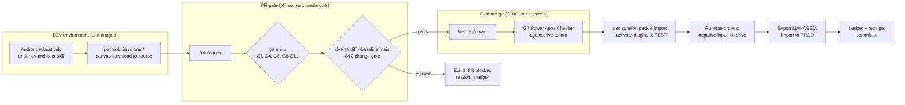

# ALM pipeline strategy: from DVerse gates to a real deployment pipeline

An exercise added at wave 8 (owner request): how the machinery this repo proved would compose into a full Application Lifecycle Management pipeline for Power Platform. Everything in the "proven here" column has a receipt in this repo; everything in the "real deployment adds" column is stated so a team adopting this pattern knows exactly what remains.

## The pipeline, end to end

## What this repo already proved, mapped to pipeline stages

| Pipeline stage | Proven here | Receipt |
|---|---|---|
| Source of truth is git, not the org | Table, form, relationship, app module, plugin registration, and canvas app all authored or mirrored as declarative YAML source | six golden imports, `demo-solution/` |
| PR gate refuses before merge | Eleven offline gates, exit-code contract 0/1/2, red fixture per gate, fail-closed runner | `harness/`, CI offline tier on every PR incl. forks |
| Change gating, not just state gating | G12 structural diff refuses burned change-classes between a baseline and the head tree | `docs/receipts/wave7-diff-refusal-pair.md` |
| Zero-secret tenant auth | OIDC federated credential pinned to main's immutable subject; no stored secret anywhere | `gates-online.yml`, green online runs |
| Import discipline | `--activate-plugins` mandatory; post-import negative-input probe mandatory (a "successful" import once shipped a disabled plugin step) | lesson 17, wave-4 close |
| Runtime verification rung | Driving the rendered UI and probing the API are the only proofs of behavior | lessons 8 and 14, wave-5 receipts |
| Environment portability of source | Canonical step carries PrimaryEntity by logical name, no org-specific GUIDs; canvas app packaged in-solution | wave-4.4c, wave-8 addendum |

## What a real deployment adds (deliberately out of this repo's scope)

1. **Environment chain**: this repo runs one PAYG environment. A real pipeline runs DEV (unmanaged, authoring) to TEST to PROD, with TEST/PROD receiving MANAGED exports. The pack/import mechanics proven here are identical; the managed conversion (`--packagetype Managed` at export) is exercised nowhere in this repo and would need its own golden import.
2. **Service principal per stage**: the OIDC pattern proven for main-branch CI generalizes to one federated credential per target environment, each pinned to its own trusted ref. No new machinery, just repetition of the proven setup per stage.
3. **Connection references and environment variables**: the canvas app's Dataverse connection is environmental today. Multi-environment deployment needs connection references and environment-variable overrides at import time (`pac solution import --settings-file`). The solution carries none yet; the identity model already anticipates them as unsurveyed types (G12 would warn, not silently pass).
4. **Release-build plugin**: the registered assembly is a Debug build by explicit ruling; a release pipeline swaps `-c Release` into the build and re-registers. One line in the workflow, one golden import to prove it.
5. **G5 as the pipeline's registration guard**: the plugin-registration sanity gate (step YAML vs plugin C#) is unblocked and specced by its ground truth; a real pipeline wants it before plugin changes flow unattended.
6. **Rollback**: solution versioning (0.1.0.0 through 0.6.0.0 here) plus managed-solution upgrade/rollback semantics; the six-import history is the pattern, the rollback path is untested.
7. **Power Platform Pipelines or Azure DevOps**: this repo's GitHub Actions tiers translate directly; Microsoft's own Pipelines feature could carry the TEST-to-PROD promotion with the gates riding in the pre-export stage.

## The strategy in one sentence

Gates refuse at the PR (cheap, offline, every contributor), the checker verifies post-merge (composed, OIDC), imports carry probes (because exit 0 lies), and every environment promotion is a solution version with a ledger entry: the same refusal ladder this repo proved, repeated per stage.
