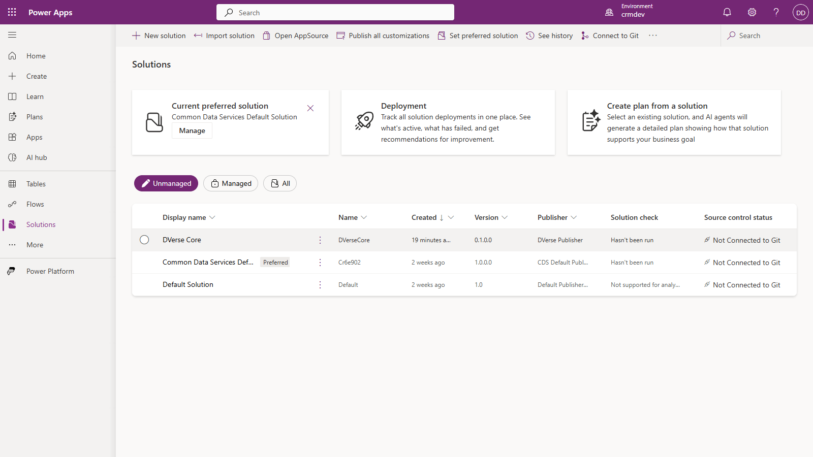
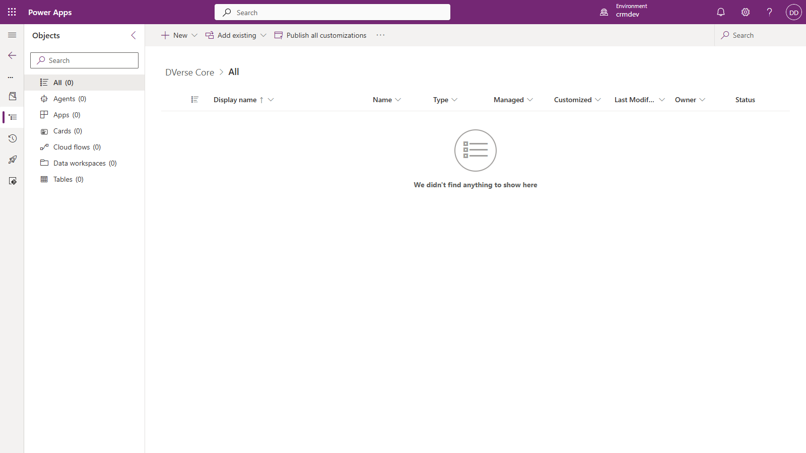

# Wave 2 closing

Closed 2026-08-13. Wave 2 delivered the CLI, both CI tiers, verified tenant provisioning, the G7 online gate, and the golden import receipt. Every claim below carries its receipt.

## Delivered

| Slice | Deliverable | Receipt |
|---|---|---|
| 2.1 | CLI `dverse gate run`, exit contract 0/1/2 | `4a66e48`, CliTests |
| 2.2 | Offline workflow, every push and PR | first green run after `fd76100`-era merge; caught a Linux-only defect on its first run |
| 2.3 | Entra app, consent, federated credential, application user | [provisioning-record.md](provisioning-record.md) |
| 2.4 | G7 Power Apps Checker gate | live verdict below |
| 2.5 | Online workflow, OIDC, zero secrets | runs 31751910173 (rerun) and 31753552568 green |
| 2.6 | Schema confirmation | partial by design: shell shapes confirmed in slice 4.1 plus the `generatedBy` finding below; component shapes follow in wave 4.2+ |
| 2.7 | Golden import receipt | this document |
| O7-O10 | path base, root containment, action bumps, path filter | all closed, see ROADMAP |

96 tests green. Gates live: G2, G4, G7, G9, G10.

## The golden import receipt (2.7)

Imported 2026-08-13 into `https://dexevo.crm.dynamics.com/` (environment `5700d87e-f783-e347-b2da-46659e769f00`, org `crmdev`).

```
Solution Importing...
Solution Imported successfully.

Unique Name   Friendly Name   Version  Managed
DVerseCore    DVerse Core     0.1.0.0  False
```

Solution id `cf648997-20ce-4594-bdcf-194343796d4e`, installed on 8/13/2026, verified by FetchXML against the live org.

### Portal evidence

The solutions list, showing DVerse Core imported alongside the stock solutions:



The solution detail, honestly empty. Wave 4.1 shipped a shell (publisher and container, zero components), and the portal shows exactly that: All (0), Tables (0), Apps (0):



## G7 live verdict (2.4)

Run locally against the real checker service and again in CI via OIDC:

```
PASS   G7   power-apps-checker                 demo-solution
Evidence: pac solution check (ruleset 'Solution Checker', geo UnitedStates)
inspected demo-solution: 0 Critical, 0 High, 0 Medium, 0 Low,
0 Informational finding(s) out of 0 total.
```

## Findings this wave, each now encoded somewhere permanent

1. **`pac solution pack` accepts what import rejects, twice over.** The packer happily packed `generatedBy: DVerse`; the platform refused the import as an On-Premises package with a blank version. `generatedBy` must be `CrmLive` and `version` must be present. Encoded as comments in `solution.yml`; the wider lesson (pack success is not import success) is the same one G9 and the planned G8 exist for.
2. **Microsoft's YAML docs contradict Microsoft's parser.** Found in 4.1 by decompiling SolutionPackagerLib; G9 realigned to enforce the real shape and refuse the documented one with an explanatory reason.
3. **Microsoft's app-registration tutorial lists an obsolete permission.** "PowerApps Runtime Service" resolves to "Previous version CDS OBSOLETE"; consent fails with AADSTS650052 until it is removed. Encoded in azure-prerequisites.md.
4. **Bare tenants cannot consent from the portal button.** First-party service principals must be provisioned via the `adminconsent` URL endpoint, which needs a redirect URI to exist. Encoded in azure-prerequisites.md.
5. **The Entra FIC form fails silently when Name is empty.** Cost one failed CI run (AADSTS70025); the address bar, not the landing page, is the consent receipt. Encoded in provisioning-record.md.
6. **Windows-only test authorship broke Linux CI three times** (Store-stub runtimes, hardcoded `C:\` literals, incoherent temp roots). The ubuntu runner is the permanent guard; each instance also left a regression test.

## Definition of done, honestly assessed

| DoD item | Status |
|---|---|
| Offline gates green with no credentials | proven on every push; the fork-PR variant is untestable until the repo is public (forking is off on private repos) |
| G7 run at least once against the real tenant, output committed | done, locally and in CI; evidence above and in CI artifacts |
| Inferred parsers confirmed against real output | shell shapes confirmed (pack, round-trip, decompilation, live import); component shapes deferred to wave 4.2+ where those components first exist |
| Golden import receipt dated and in git | this document |

## Environment note

Pay-as-you-go, no expiry. Auditing confirmed off, so the no-floor log-storage meter is inert. The online workflow is path-filtered (O10): doc-only pushes, including the commit that adds this document, run the offline tier only. That skip is itself the filter's receipt.

## Wave 3 next

G1 well-formedness, G3 dependency integrity, G8 rootcomponents (the standing gap), G5 plugin registration sanity, G6 build and tests. All offline, all executor slices.
